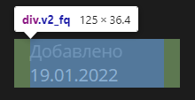
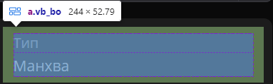

# Парсеры данных тайтлов с сайтов Mangalib и Remanga через аккаунт Google
- Mangalib - все закладки, кроме 'В планах'
- Remanga - все закладки, кроме 'Буду читать' и 'Не интересно'

Parse selenium python 3.11:
  - pandas
  - jupyter
  - openpyxl
  - python-dotenv
  - undetected-chromedriver

---
### Get started
1. Файл `.env`
   ```
   GOOGLE_LOG=логин google
   GOOGLE_PASS=пароль google
   
   # mangalib.me / test-front.mangalib.me
   MANGALIB_ID=
   BOOKMARK_TITLE_CLASS=v2_bo
   BOOKMARK_TITLE_ADDED=v2_fq
   TITLE_DATA_CLASS=vb_c7
   ```
   
   * `MANGALIB_ID` - зайдите с браузера в профиль (например, `mangalib.me/user/55`, значит `MANGALIB_ID`=55)
   
   * Следующие параметры меняются на test-front, поэтому пока что вынесены в .env
     - `BOOKMARK_TITLE_ADDED` - в закладках
            
     
    
     - `BOOKMARK_TITLE_CLASS` - Тип на странице тайтла
        
     
        
     - `TITLE_DATA_CLASS` - Альтернативные названия на странице тайтла
        
     

2. Устанавливаем пакеты 
    ```bash
    pip install -r requirements.txt
    ```

3. Файл `work_example.ipynb`
   
   - Запускаем браузер и авторизуемся
     *(p.s. из-за двойной аутентификации браузер не скрыт)*
   
   - Парсим данные
   - Результаты в директориии parse-data

---
### Mangalib
В данный момент 2 версии сайта:
1. mangalib.me (`parser_mangalib_old`)
    *(p.s. написан ~16.12.2023, работает, но стал пропускать тайтлы)*

   - 324 тайтла  ~11-13 минут 
   - Место сохранения: `parse-data/parse_mangalib1.xlsx`

2. test-front.mangalib.me
   *(p.s. тестовый, поэтому сам сайт пока что тормозит при парсинге)*

   - 324 тайтла = 22 мин 24 сек
   - Место сохранения: `parse-data/parse_mangalib.xlsx` 

### Remanga
- 253 тайтла = 8 мин 56 сек
- Место сохранения: `parse-data/parse_remanga.xlsx` 

---
### Формат данных
|     Название      |                Описание                 | Mangalib | Remanga |
|:-----------------:|:---------------------------------------:|:--------:|:-------:|
|      Name_ru      |           Название на русском           |    ✅     |    ✅    |
|     Name_eng      |         Название на английском          |    ✅     |    ✅    |
|       Type        |    Тип тайтла (манга, манхва, т.д.)     |    ✅     |    ✅    |
|    Date_added     |       Дата добавления в закладки        |    ✅     |    ❌    |
| Alternative_names | Альтернативные переводы названия тайтла |    ✅     |    ✅    |

